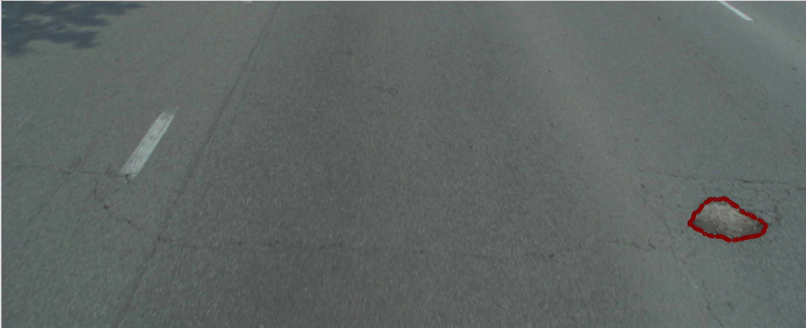
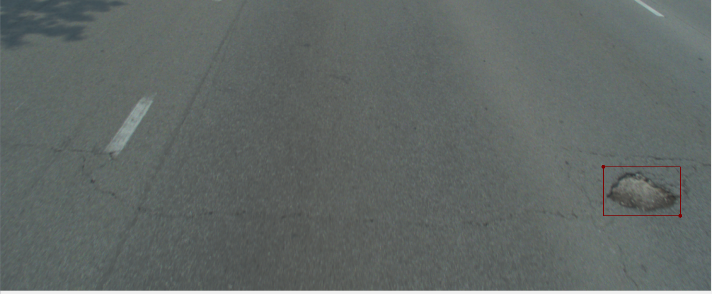

# YOLO Annotation to Segmentation Converter

This project provides a script to convert YOLO-style rectangle annotations to segmentation annotations. It uses the bounding box coordinates provided in the YOLO format and generates corresponding segmentation masks. The output of the script will be JSON files saved at the specified path.

<p float="left" align="center">
  
   
</p>
## Prerequisites

Before you run the script, please ensure you meet the following prerequisites:

- **NVIDIA GPU**: You need an NVIDIA GPU with at least 8GB of VRAM.
- **Torch with CUDA**: Make sure you have Torch installed with CUDA support.


## Installation

Follow these steps to install and run the script:

<<<<<<< HEAD
1. **Clone the repository**: Use the following command:
    ```shell
=======
1. **Clone the Repository Locally**: Use the following command to clone the repo:
   ```shell
>>>>>>> 95905efa73aa75b5f81c534de0ca125ca7b0b3c2
    git clone --recursive https://github.com/Younis-Matouq/converting_YOLO_style_rectangle_annotations_to_segmentation_annotations.git
    ```

1. **Navigate to the Project Directory**: Install the required Python packages using `pip`:

   ```shell
    pip install -r requirements.txt
    ```
2. **Navigate to the Project Directory**: Use the `cd` command to navigate into the `segment-anything` directory:

    ```shell
    cd segment-anything
    ```

3. **Install the Requirements**: Install the required Python packages using `pip`:

    ```shell
    pip install -e .
    ```

## Configuration

The script uses a `config.yaml` file to pass arguments to the main script. To run the script properly, you must update this file with your specific settings. Here's a description of what each setting does:

- `annotation_directory`: The directory where the script will find the YOLO-style annotation files it must be a JSON file.
- `img_directory`: The directory where the corresponding images for the annotations are stored.
- `sam_checkpoint_path`: The path to the SAM model checkpoint file. The checkpoint is available at segment-anything\sam_vit_h_4b8939.pth
- `saving_path`: The directory where the script will save the output JSON files.
- `smooth`: A boolean flag indicating whether to apply a smoothing operation to the segmentation masks (set to `True` or `False`).

Below is an example of how your `config.yaml` file might look:

```yaml
annotation_directory: annotation_directory\annots
img_directory: img_directory\imgs
sam_checkpoint_path: sam_checkpoint_path\sam_vit_h_4b8939.pth
saving_path: saving_path\results
smooth: False
```

## Usage 
**To run the script use the following command.**

    ```shell
    python converting_annotations_engine.py --config config.yaml
    ```

## Output

Once you run the script, it will process the images and annotations in the specified directories, converting the YOLO-style bounding box annotations into segmentation annotations. 

The output will be a set of JSON files containing the segmentation annotations. These files will be in a format compatible with YOLO.

The JSON files will be saved in the directory specified by the `saving_path` parameter in the `config.yaml` file.

> :information_source: **Note:** The annotations must be json files. If you have txt annotations use convert_text_to_labelme.py script to convert your annotations to JSON formate.

## License

This project is licensed under the terms of the MIT License.


